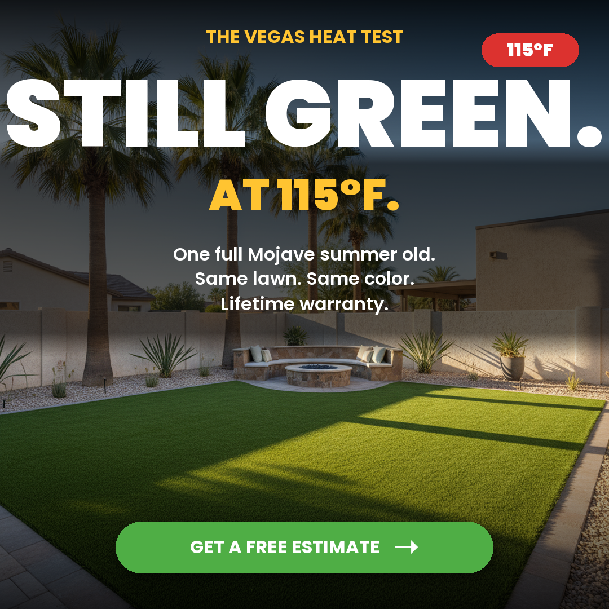
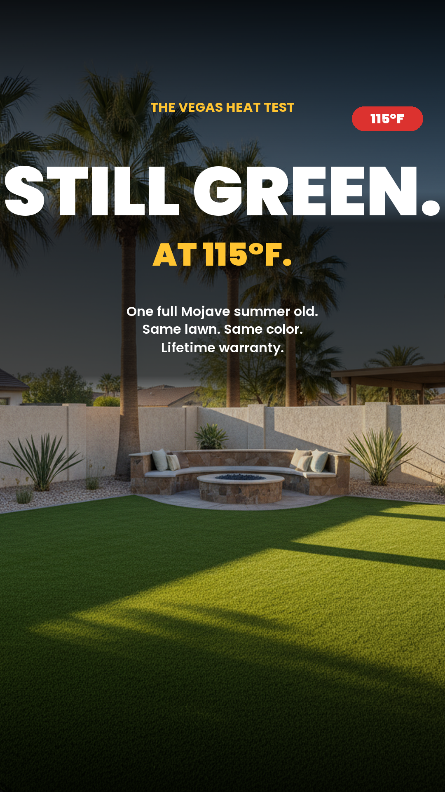
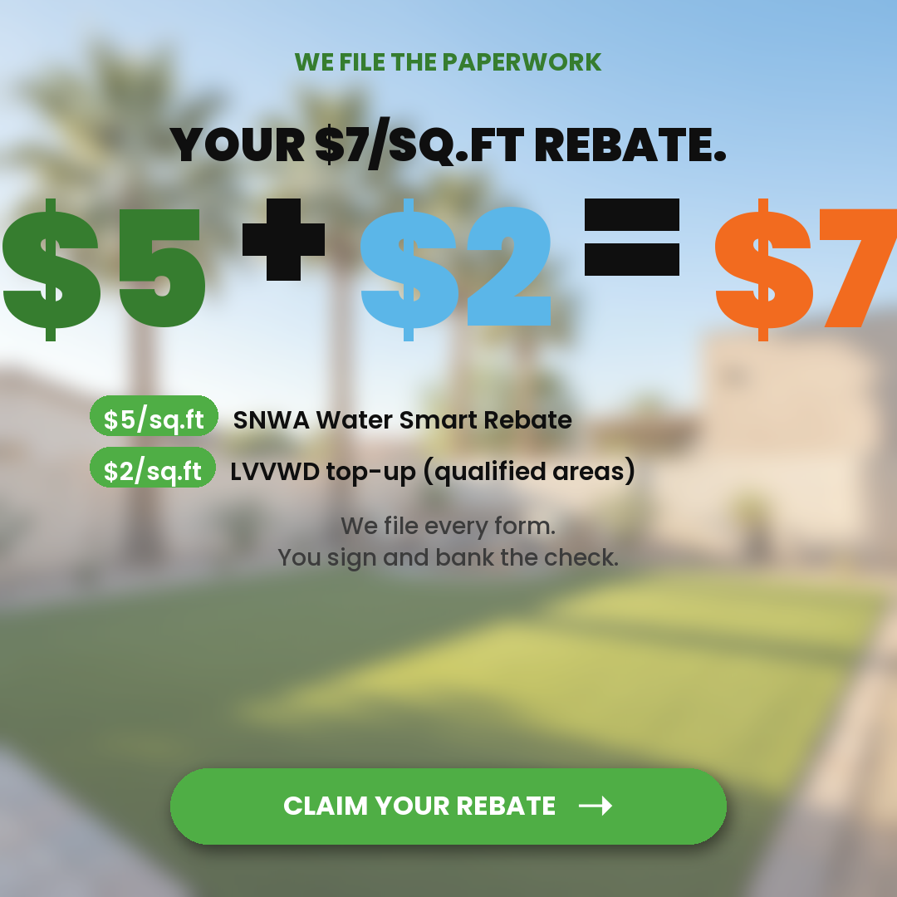
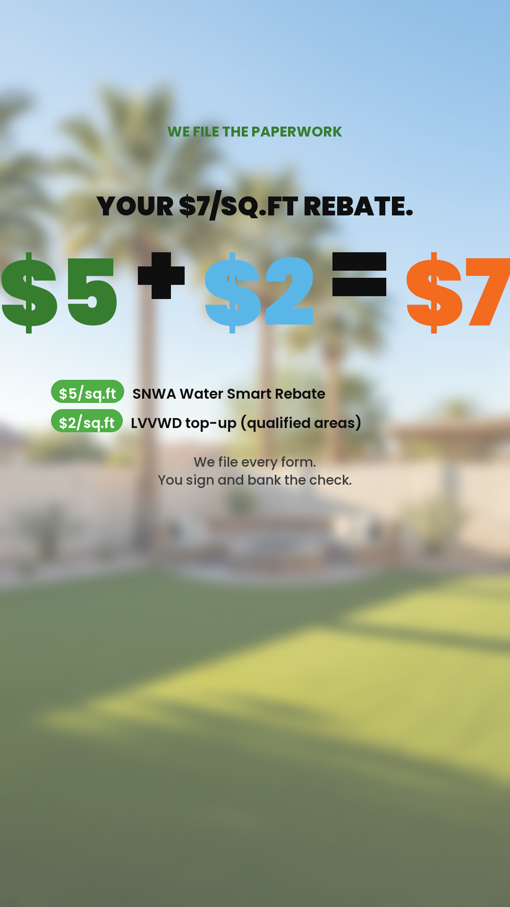
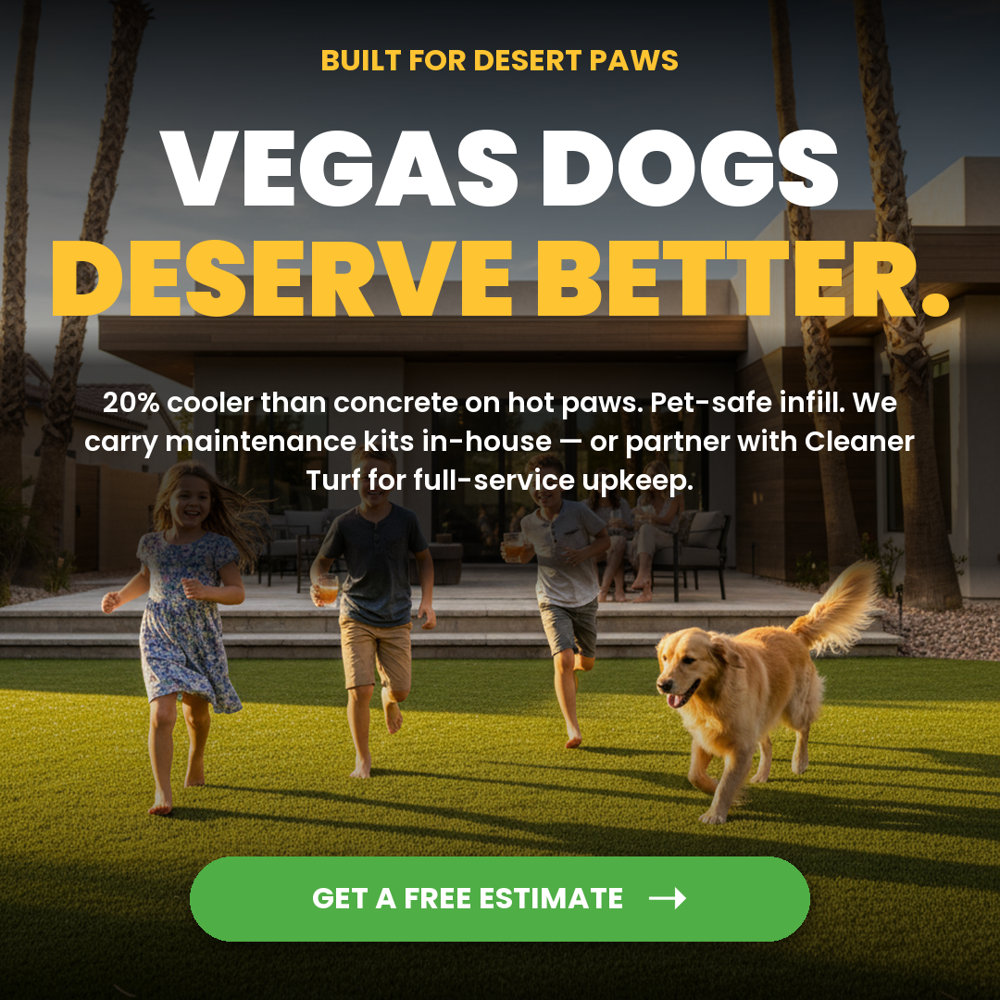
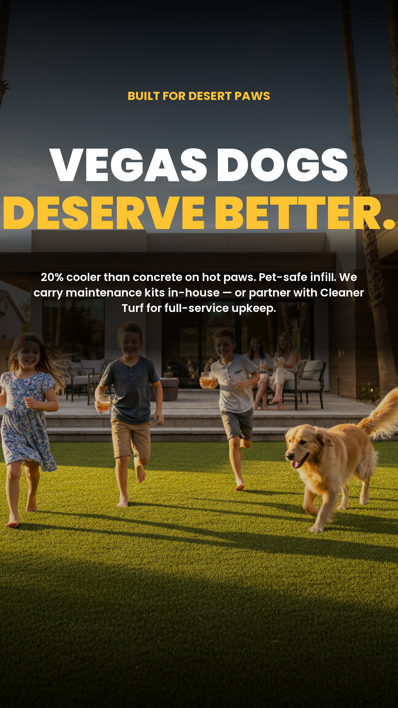
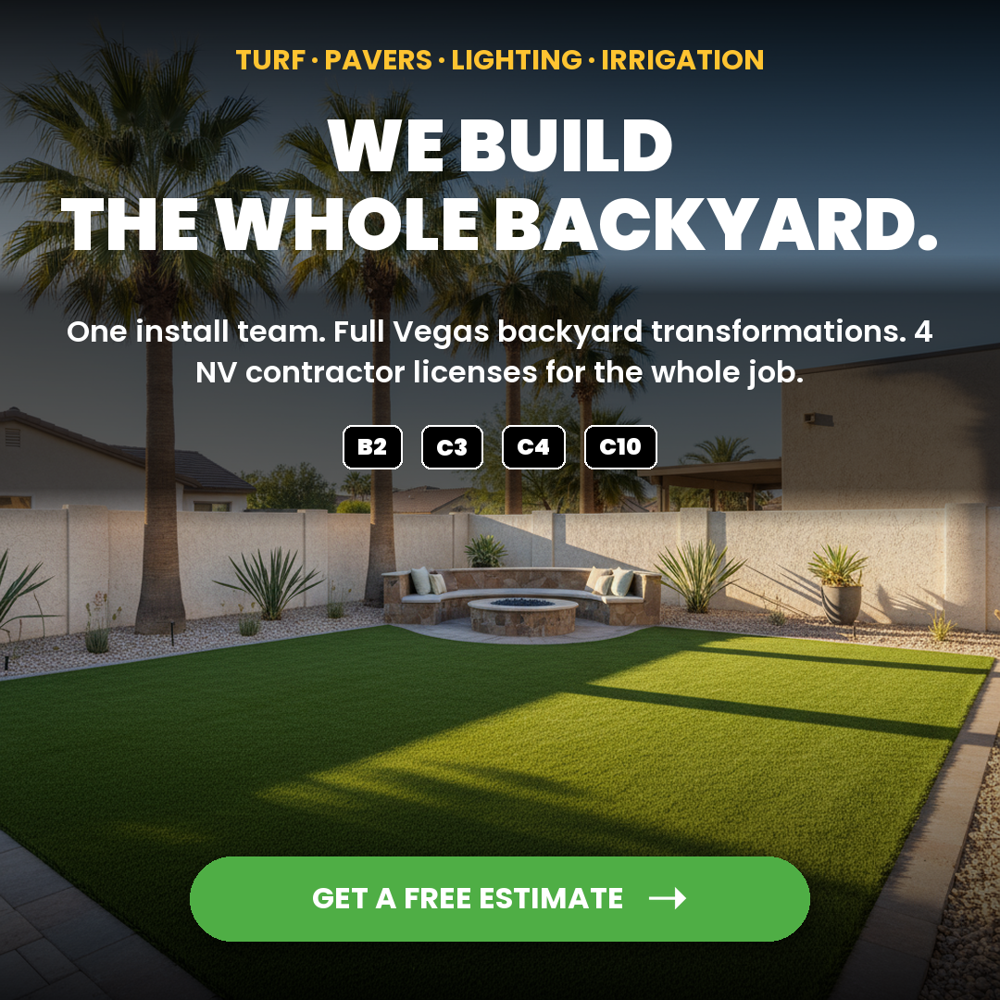
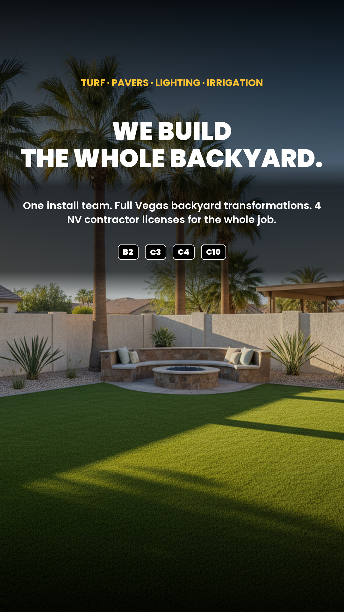
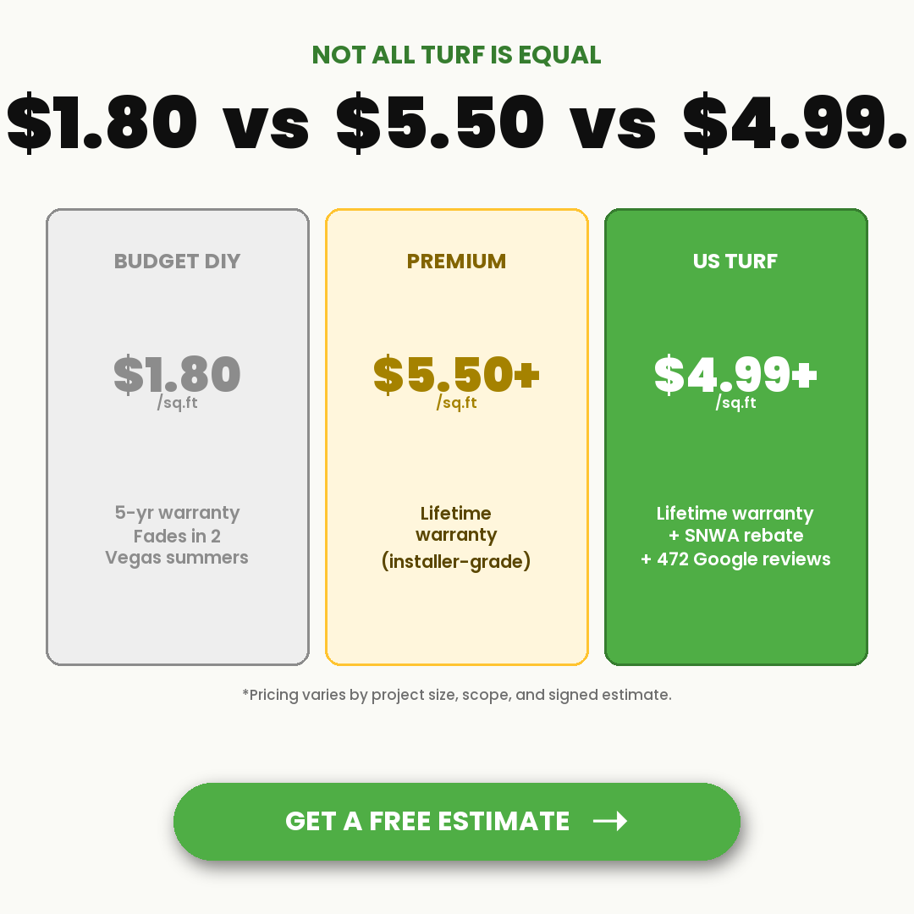
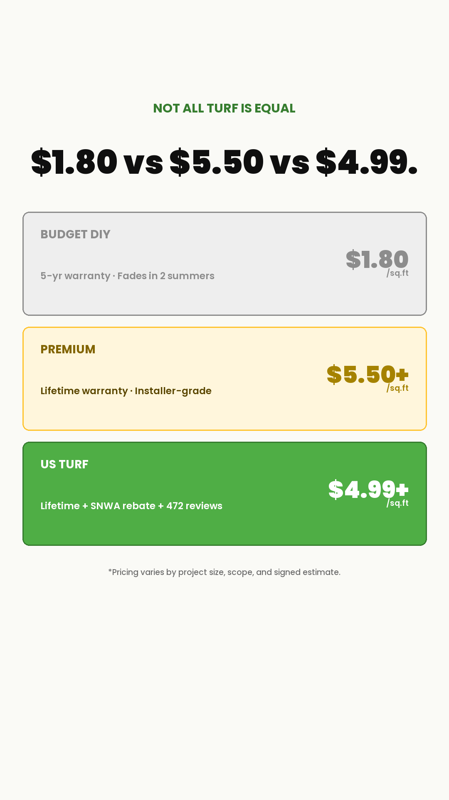

# US Turf — May 2026 Creative Batch

Two batches built from the competitor LP teardown:

- **[Phase 2 — Prospecting (6 variants)](#phase-2--prospecting-batch)** — built 2026-05-06, destination: 2/23 Ads scaling adset
- **[Phase 4 — Retargeting (5 variants)](#phase-4--retargeting-batch)** — built 2026-05-07, destination: warm retargeting audience (visited social2026 LP, didn't convert)

Total: 11 variants × 2 ratios = 22 final ad creatives. All claims verified against US Turf project memory + live LP + client confirmation.

---

## Phase 2 — Prospecting Batch

**6 variants × 2 ratios (1:1 + 9:16) = 12 final ad creatives**
Destination: 2/23 Ads scaling adset (live, $40/day, $31 CPL last 3d).

---

## V1 — STAT-SHOCK: 472 Vegas Families
**Source signal:** Turf Bros wins on review-volume framing. Frame as families, not stars.

| 1:1 | 9:16 |
|---|---|
|  |  |

## V2 — REBATE MATH: $5 + $2 = $7
**Source signal:** Simply Turf's breakdown beats "up to $7" for credibility.

| 1:1 | 9:16 |
|---|---|
|  |  |

## V3 — PAYMENT ANCHOR: $166/MO
**Source signal:** Counter SYNLawn's 24-48mo financing by anchoring on monthly payment.

| 1:1 | 9:16 |
|---|---|
|  |  |

## V4 — LONGEVITY: 22 Years. One Family.
**Source signal:** Direct counter to Panda Turf's recent license #0095121.

| 1:1 | 9:16 |
|---|---|
|  |  |

## V5 — TRUST BLOCK: 4 NV Licenses
**Source signal:** Panda displays one license #. We have FOUR — implies general-contractor scope.

| 1:1 | 9:16 |
|---|---|
|  |  |

## V6 — WARRANTY COMPARISON: Lifetime vs 10-Year
**Source signal:** Panda warranties 10 years. We warranty for life.

| 1:1 | 9:16 |
|---|---|
|  |  |

---

## Production notes
- Built via [build-batch.py](build-batch.py)
- Photos sourced from `/skills/product-visual-generator/brands/usturf/competitor-assets/`
- Brand DNA: Poppins Black/Bold/SemiBold/Medium, US Turf green #4FAE45, Vegas blue #5BB6E8, gold accent
- Two static assets per variant (no motion this batch — motion variants reserved for V1/V4 if winners)

## Upload-ready paths

### 1:1 (square — Feed/Marketplace)
- `renders/ad-batch/may2026/1x1/V1-stat-shock-472-families-1x1.png`
- `renders/ad-batch/may2026/1x1/V2-rebate-math-7-back-1x1.png`
- `renders/ad-batch/may2026/1x1/V3-payment-anchor-166mo-1x1.png`
- `renders/ad-batch/may2026/1x1/V4-longevity-22-years-1x1.png`
- `renders/ad-batch/may2026/1x1/V5-trust-block-4-licenses-1x1.png`
- `renders/ad-batch/may2026/1x1/V6-warranty-lifetime-vs-10yr-1x1.png`

### 9:16 (vertical — Reels/Stories)
- `renders/ad-batch/may2026/9x16/V1-stat-shock-472-families-9x16.png`
- `renders/ad-batch/may2026/9x16/V2-rebate-math-7-back-9x16.png`
- `renders/ad-batch/may2026/9x16/V3-payment-anchor-166mo-9x16.png`
- `renders/ad-batch/may2026/9x16/V4-longevity-22-years-9x16.png`
- `renders/ad-batch/may2026/9x16/V5-trust-block-4-licenses-9x16.png`
- `renders/ad-batch/may2026/9x16/V6-warranty-lifetime-vs-10yr-9x16.png`

---

## Phase 4 — Retargeting Batch

**5 variants × 2 ratios (1:1 + 9:16) = 10 final ad creatives**
Built 2026-05-07. Destination: warm retargeting audience (visited social2026 LP, didn't convert).

Each variant addresses a SPECIFIC objection that kept warm visitors from converting. Tone is direct, conversational — "let me address the thing you're worried about."

Full copy spec: [copy-spec-retargeting.md](copy-spec-retargeting.md)

### R1 — HEAT SURVIVAL: "Will it stay green in 115°?"
**Concern:** Vegas summers will fry the turf.

| 1:1 | 9:16 |
|---|---|
|  |  |

### R2 — REBATE TRUST: "Will the rebate actually pay out?"
**Concern:** Rebate paperwork is a nightmare or won't qualify.

| 1:1 | 9:16 |
|---|---|
|  |  |

### R3 — PET DURABILITY: "Can my dog destroy it?"
**Concern:** Claws/digging/urine will trash the install.
**Note:** Per client (2026-05-07), warranty does NOT cover pet damage. Copy pivots to verified product features (20% cooler than concrete, pet-safe infill) + in-house maintenance products + Cleaner Turf partnership.

| 1:1 | 9:16 |
|---|---|
|  |  |

### R4 — FULL-YARD UPSELL: "What about pavers + lighting?"
**Concern:** US Turf only does grass — left to find a full-scope contractor.

| 1:1 | 9:16 |
|---|---|
|  |  |

### R5 — QUALITY-TIER ANCHOR: "$1.80 vs $5.50 vs $4.99+"
**Concern:** Comparing to budget DIY/Home Depot turf.
**Note:** "Starts at $4.99" softening + disclaimer per client request (avoid "ad price vs final estimate" issues).

| 1:1 | 9:16 |
|---|---|
|  |  |

### Phase 4 Upload-ready paths

**1:1 (square — Feed/Marketplace)**
- `renders/ad-batch/may2026-retargeting/1x1/R1-heat-115-degrees-1x1.png`
- `renders/ad-batch/may2026-retargeting/1x1/R2-rebate-paperwork-1x1.png`
- `renders/ad-batch/may2026-retargeting/1x1/R3-vegas-dogs-1x1.png`
- `renders/ad-batch/may2026-retargeting/1x1/R4-full-yard-1x1.png`
- `renders/ad-batch/may2026-retargeting/1x1/R5-pricing-compare-1x1.png`

**9:16 (vertical — Reels/Stories)**
- `renders/ad-batch/may2026-retargeting/9x16/R1-heat-115-degrees-9x16.png`
- `renders/ad-batch/may2026-retargeting/9x16/R2-rebate-paperwork-9x16.png`
- `renders/ad-batch/may2026-retargeting/9x16/R3-vegas-dogs-9x16.png`
- `renders/ad-batch/may2026-retargeting/9x16/R4-full-yard-9x16.png`
- `renders/ad-batch/may2026-retargeting/9x16/R5-pricing-compare-9x16.png`
