# US Turf — Phase 2 Creative Batch

**6 variants × 2 ratios (1:1 + 9:16) = 12 final ad creatives**
Built 2026-05-06 from competitor LP teardown findings. All claims verified against US Turf project memory + live LP.

Destination: 2/23 Ads scaling adset (live, $40/day, $31 CPL last 3d).

---

## V1 — STAT-SHOCK: 472 Vegas Families
**Source signal:** Turf Bros wins on review-volume framing. Frame as families, not stars.

| 1:1 | 9:16 |
|---|---|
| 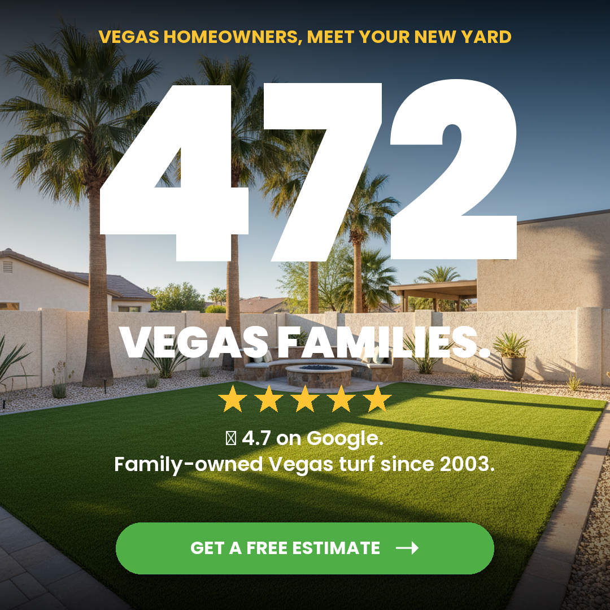 | 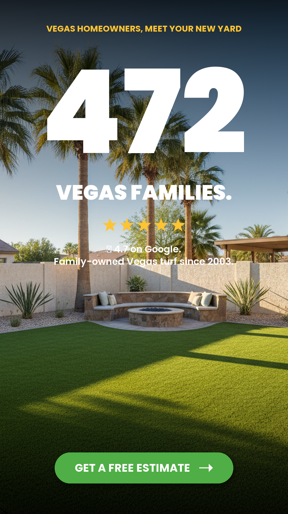 |

## V2 — REBATE MATH: $5 + $2 = $7
**Source signal:** Simply Turf's breakdown beats "up to $7" for credibility.

| 1:1 | 9:16 |
|---|---|
| 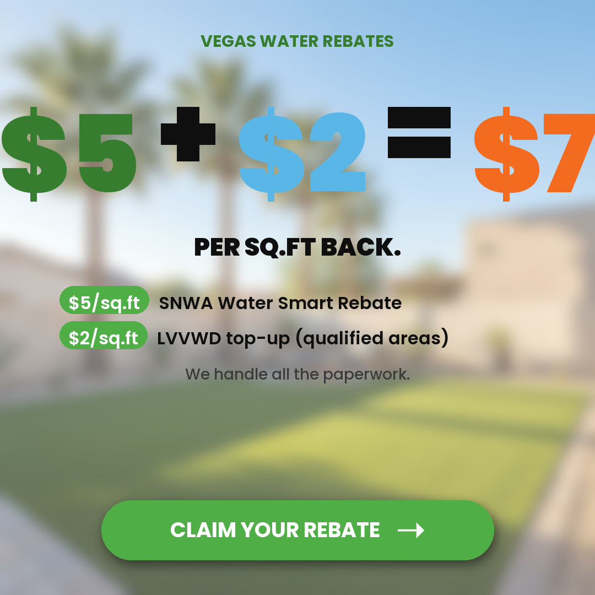 | 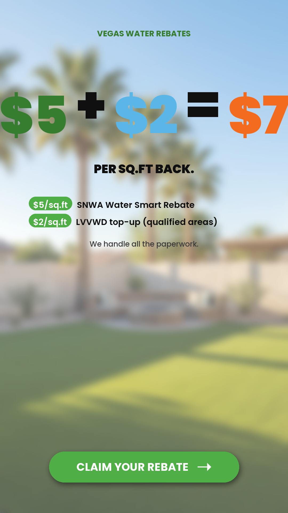 |

## V3 — PAYMENT ANCHOR: $166/MO
**Source signal:** Counter SYNLawn's 24-48mo financing by anchoring on monthly payment.

| 1:1 | 9:16 |
|---|---|
| 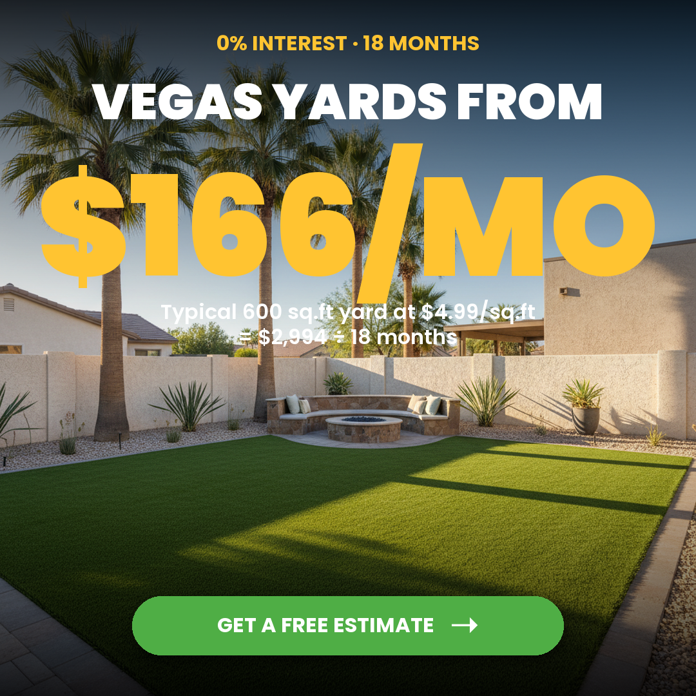 | 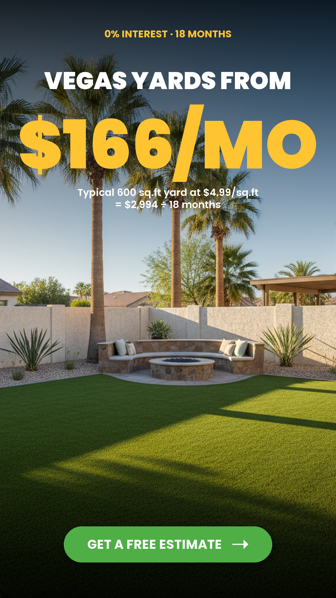 |

## V4 — LONGEVITY: 22 Years. One Family.
**Source signal:** Direct counter to Panda Turf's recent license #0095121.

| 1:1 | 9:16 |
|---|---|
| 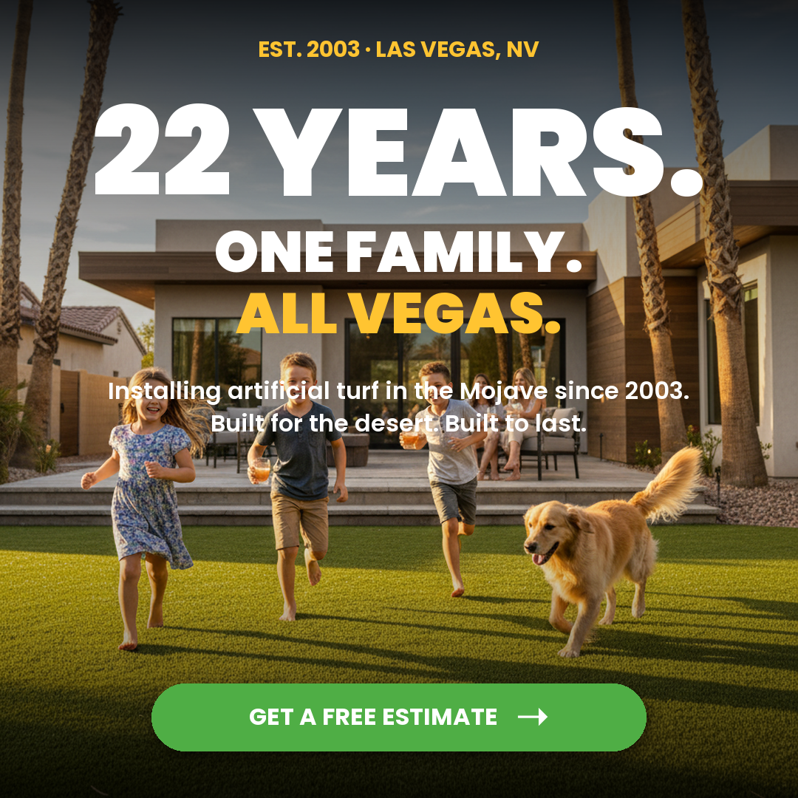 | 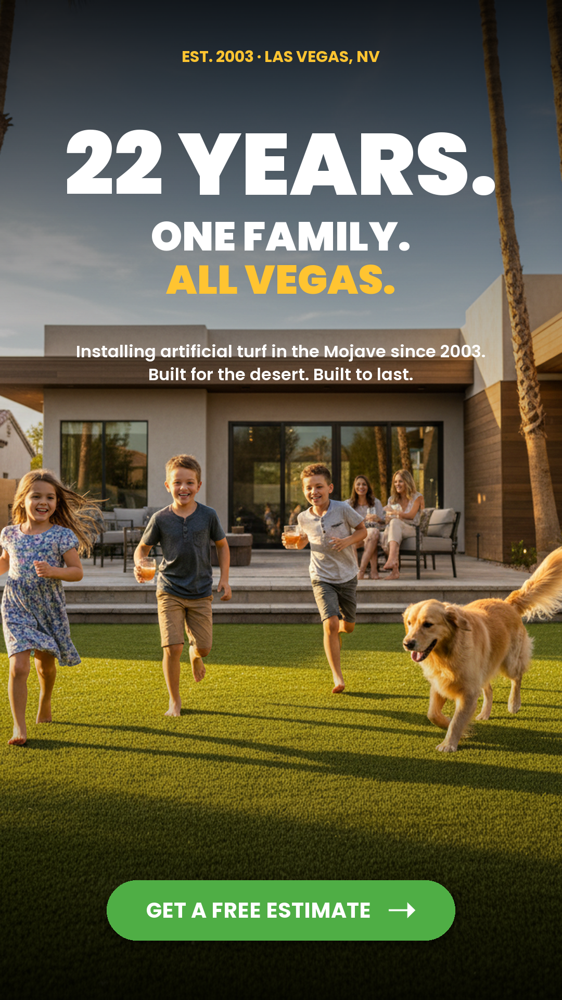 |

## V5 — TRUST BLOCK: 4 NV Licenses
**Source signal:** Panda displays one license #. We have FOUR — implies general-contractor scope.

| 1:1 | 9:16 |
|---|---|
| 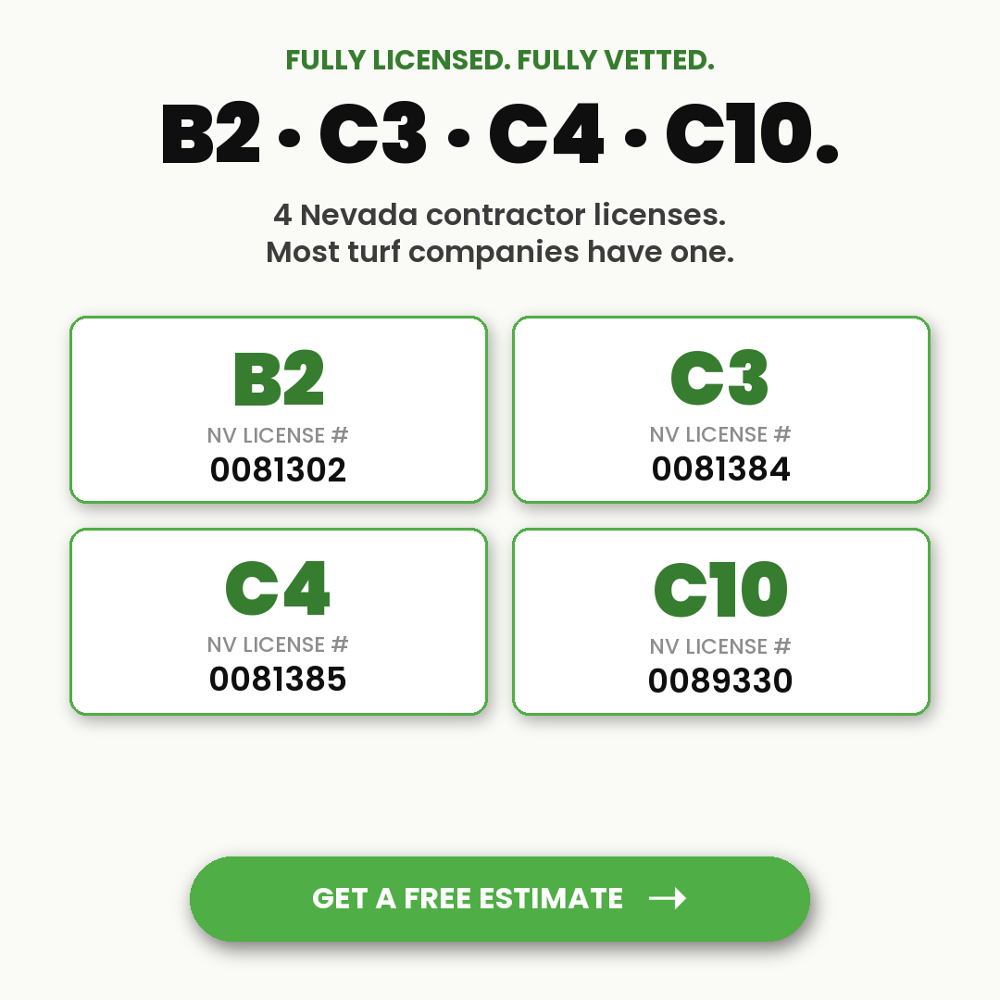 | 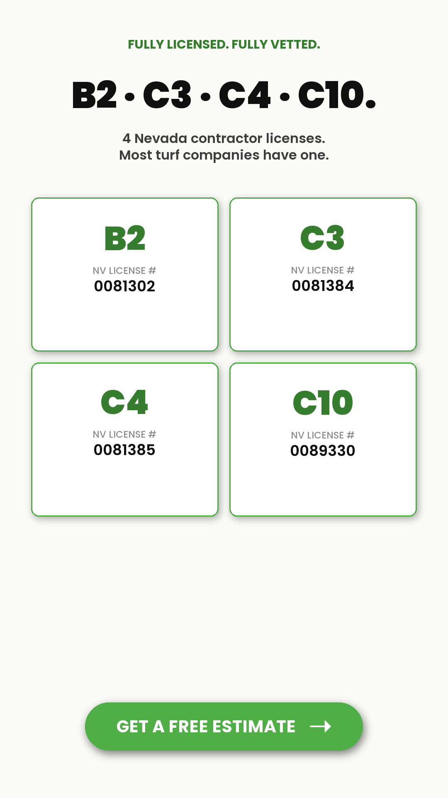 |

## V6 — WARRANTY COMPARISON: Lifetime vs 10-Year
**Source signal:** Panda warranties 10 years. We warranty for life.

| 1:1 | 9:16 |
|---|---|
| 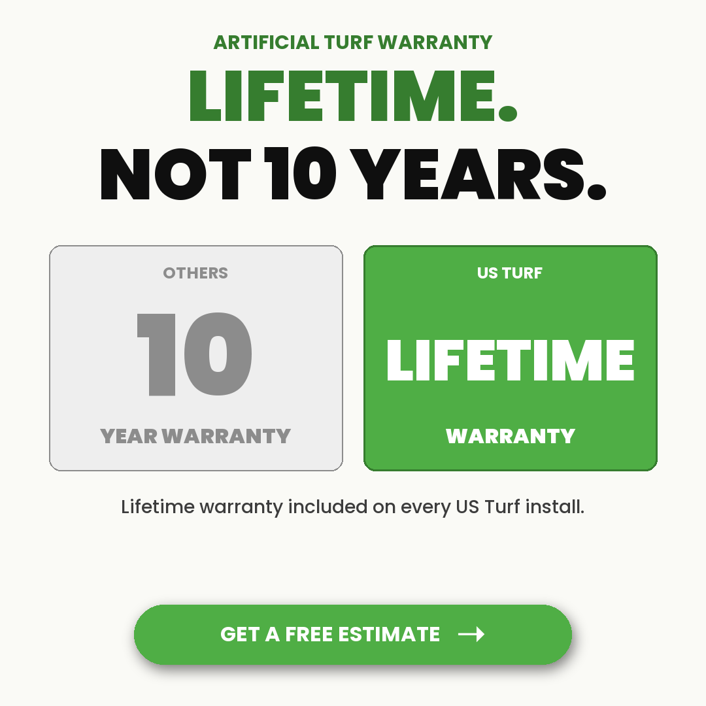 | 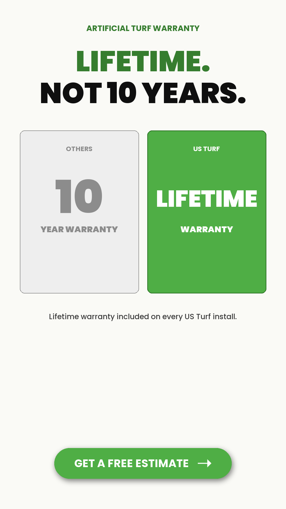 |

---

## Production notes
- Built via [build-batch.py](build-batch.py)
- Photos sourced from `/skills/product-visual-generator/brands/usturf/competitor-assets/`
- Brand DNA: Poppins Black/Bold/SemiBold/Medium, US Turf green #4FAE45, Vegas blue #5BB6E8, gold accent
- Two static assets per variant (no motion this batch — motion variants reserved for V1/V4 if winners)

## Upload-ready paths

### 1:1 (square — Feed/Marketplace)
- `renders/ad-batch/may2026/1x1/V1-stat-shock-472-families-1x1.png`
- `renders/ad-batch/may2026/1x1/V2-rebate-math-7-back-1x1.png`
- `renders/ad-batch/may2026/1x1/V3-payment-anchor-166mo-1x1.png`
- `renders/ad-batch/may2026/1x1/V4-longevity-22-years-1x1.png`
- `renders/ad-batch/may2026/1x1/V5-trust-block-4-licenses-1x1.png`
- `renders/ad-batch/may2026/1x1/V6-warranty-lifetime-vs-10yr-1x1.png`

### 9:16 (vertical — Reels/Stories)
- `renders/ad-batch/may2026/9x16/V1-stat-shock-472-families-9x16.png`
- `renders/ad-batch/may2026/9x16/V2-rebate-math-7-back-9x16.png`
- `renders/ad-batch/may2026/9x16/V3-payment-anchor-166mo-9x16.png`
- `renders/ad-batch/may2026/9x16/V4-longevity-22-years-9x16.png`
- `renders/ad-batch/may2026/9x16/V5-trust-block-4-licenses-9x16.png`
- `renders/ad-batch/may2026/9x16/V6-warranty-lifetime-vs-10yr-9x16.png`
